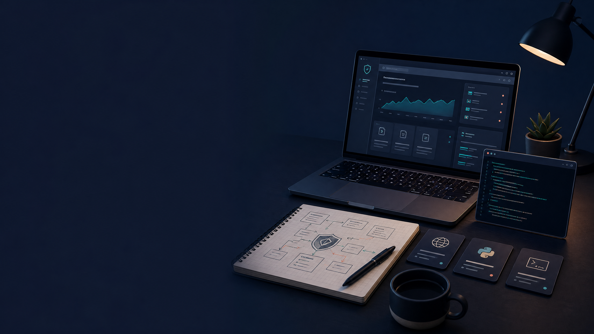

# Kawã Silva dos Santos

  

<strong>Estudante de Segurança da Informação · Python · Automação · Desenvolvimento Web</strong>

Estou construindo uma trajetória prática em tecnologia, com interesse em segurança da informação, desenvolvimento de aplicações web e automação. Curso **Tecnólogo em Segurança da Informação** desde julho de 2026 e busco oportunidades de estágio ou posições júnior nas quais eu possa aprender, contribuir e evoluir com responsabilidade.

## Formação

| Etapa | Situação |
|---|---|
| Tecnólogo em Segurança da Informação | Em andamento — início em 17/07/2026 |
| Ensino médio | Concluído — CIEP 355 Roquete Pinto, Queimados/RJ |

## Áreas de interesse

- Desenvolvimento seguro, fundamentos de segurança da informação e boas práticas de privacidade.
- Python, automação e ferramentas para terminal Linux.
- Desenvolvimento web com TypeScript, React e Next.js.
- APIs, banco de dados relacional e integração de serviços.

## Projetos em destaque

| Projeto | Descrição |
|---|---|
| [eShark](https://github.com/LEVIATAD21/eshark) | Protótipo PWA de comparação transparente de ofertas, com engine de decisão e práticas defensivas no frontend. |
| [AI Agents Team](https://github.com/LEVIATAD21/ai-agents-team) | Experimento em Python para coordenação de agentes de terminal e planejamento colaborativo. |
| [CRIS Rating Demo](https://github.com/LEVIATAD21/cris-rating-demo) | Protótipo visual de avaliação explicável de risco com evidências e trilha de auditoria. |
| [Padaria Xodó](https://github.com/LEVIATAD21/Padaria-xod-) | Projeto full stack em desenvolvimento para pedidos e gestão em padaria. |

## Tecnologias em estudo e prática

`Python` · `JavaScript` · `TypeScript` · `React` · `Next.js` · `Node.js` · `PostgreSQL` · `Git` · `Linux`

## Contato profissional

Estou aberto a oportunidades de aprendizado, colaboração e projetos compatíveis com meu nível atual de formação.

- GitHub: [@LEVIATAD21](https://github.com/LEVIATAD21)
- LinkedIn: [Kawã Silva](https://linkedin.com/in/kawa-silva-dev)

> Este portfólio é mantido com foco em projetos reais, documentação clara e aprendizado contínuo.
